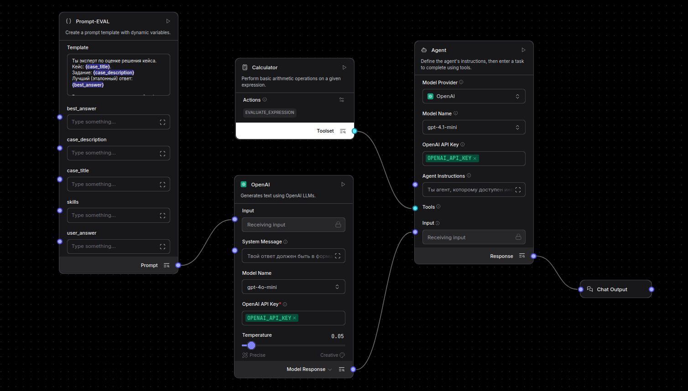
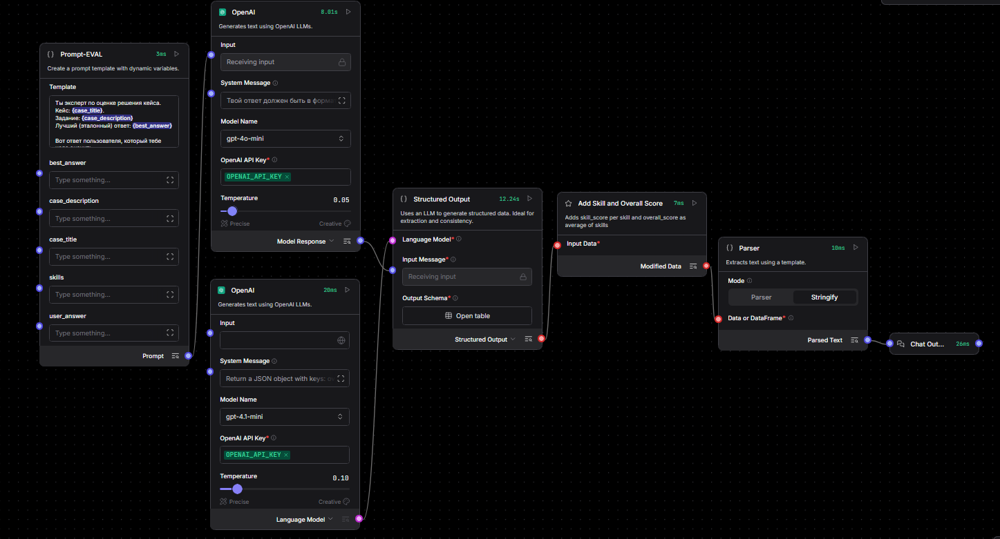
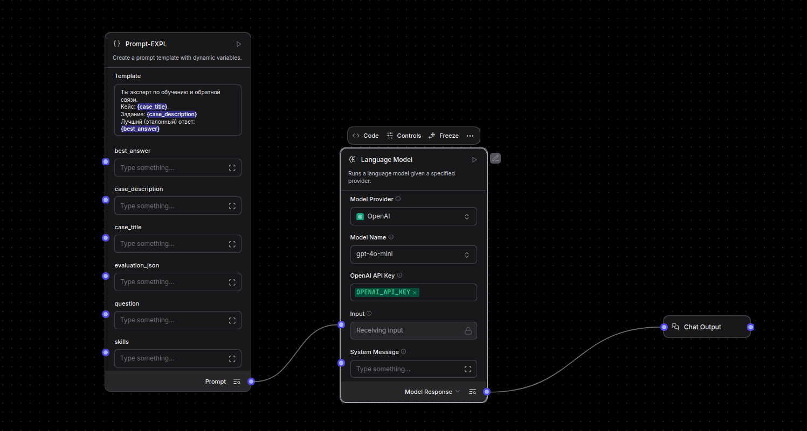
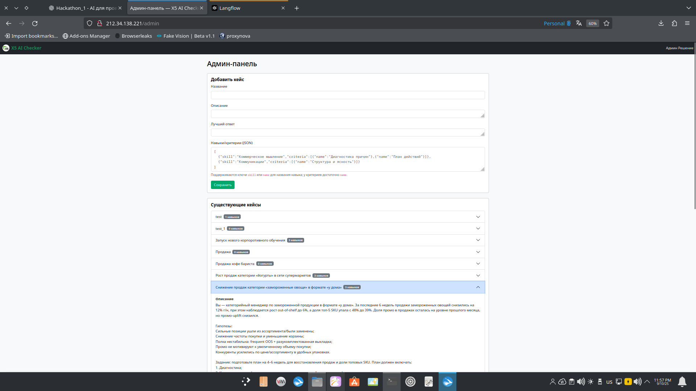
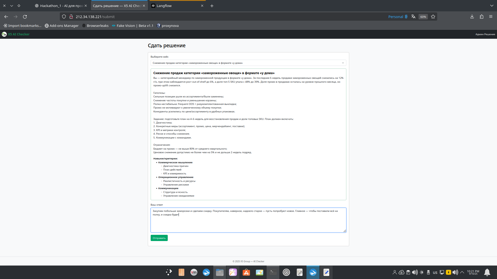
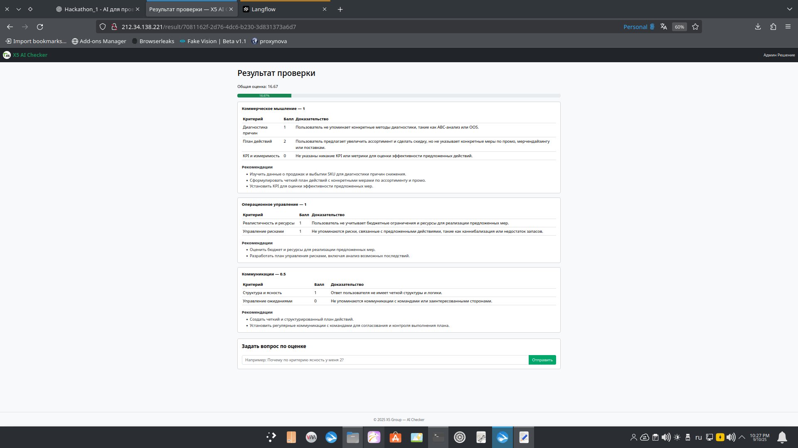
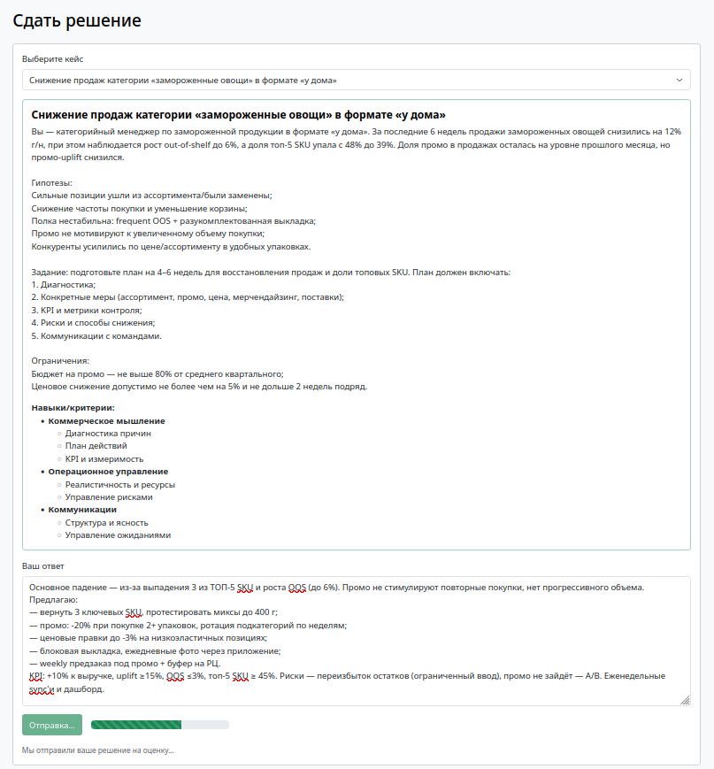
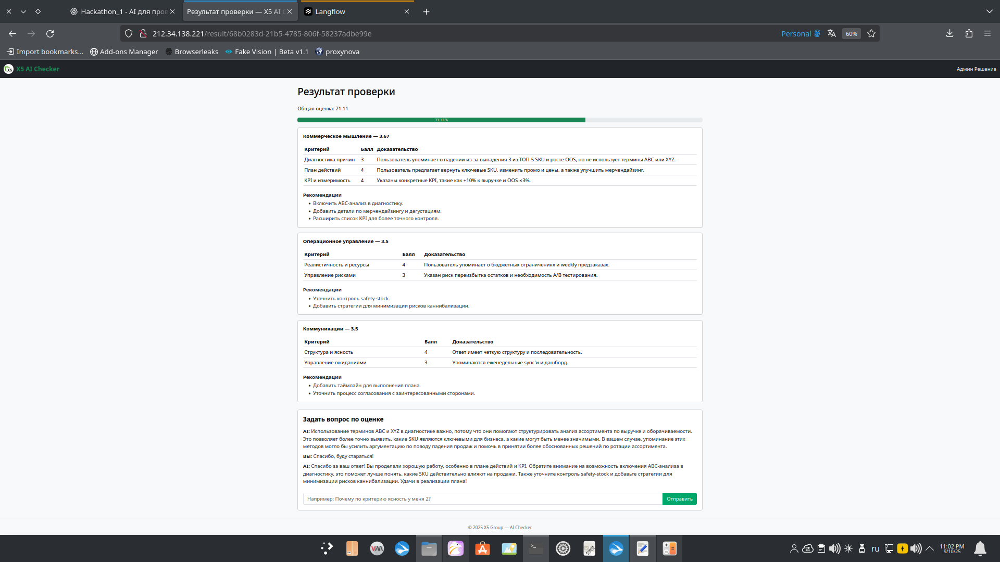

# CaseCompass  

## 1. Краткое описание проекта
CaseCompass — это система оценки обучающих кейсов с использованием AI.  
Разработанное решение позволяет:
- администратору загружать обучающие кейсы;  
- пользователю вводить текстовое решение кейса;  
- пользователю получать оценку его решения по заранее заданным в кейсе **навыкам и критериям** и **эталонному ответу**;  
- пользователю получить пояснения и рекомендации по его решению кейса;  
- пользователю задать уточняющие вопросы по его решению кейса;  
- пользователю получать ответы на уточняющие вопросы.  

---

## 2. Архитектура и стек технологий

- **Frontend + Backend**: Flask;  
- **База данных**: PostgreSQL (SQLAlchemy);  
- **LLM**: Langflow (на основе OpenAI);  
- **Реверс-прокси и статика**: Nginx;  
- **Деплой**: Docker (docker-compose).  

Архитектура построена по принципу микросервисов с возможностью развертывания в Docker (localhost, VPS):
- данные хранятся в Postgres (для Backend и для Langflow);  
- веб-приложение реализовано на Flask и включает Backend-логику (эндпойнты API, работа с базой данных, интеграция с Langflow через клиента) и Frontend (шаблоны Bootstrap + JS);  
- для маршрутизации используется Nginx, который отдаёт статику и проксирует запросы на API и Langflow UI;  
- основной инструмент обработки решений — Langflow, где собраны потоки (flows) для оценки решения кейса и уточняющих вопросов.  

---

## 3. Развертывание в Docker

```bash
# Клонировать репозиторий:
git clone <repo-url>
cd <repo-name>

# Создать .env из .env.example

# Запустить сервисы:
docker-compose up -d --build

# Проверка:
docker ps -a
```
По умолчанию:  
- Frontend через Nginx (админ-панель) — `http://<IP>/admin`  
- Frontend через Nginx (решение кейса) — `http://<IP>/submit`  
- Langflow UI — `http://<IP>:7860`  

---

## 4. Интеграция

1. Пользователь вводит решение кейса (два эндпойнта: ```/submit_solution``` для оценки решения и ```/ask``` для уточняющих вопросов - эти эндпойнты прописаны в ```backend/app/blueprints```, именно по выбранному эндпоинту Backend понимает, в какой flow передавать данные: или для оценки, или для уточняющих вопросов).

2. Flask-Backend принимает ответ и через **langflow_client.py** вызывает нужный **flow** в Langflow API (отправляет POST /api/v1/run/{flow_id} и передаёт в payload объект ```tweaks```, в котором по имени узла указываются все переменные, которые должны попасть внутрь промпта на стороне Langflow):  

```
prompt_vars = {
        "case_title": case.title,
        "case_description": _clip(case.description, CLIP_DESC),
        "best_answer": _clip(case.best_answer, CLIP_DEFAULT),
        "skills": json.dumps(case.skills_json or [], ensure_ascii=False),
        "user_answer": _clip(user_answer, CLIP_DEFAULT),
    }
    body = {
        "input_value": "",
        "input_type": "chat",
        "output_type": "chat",
        "tweaks": {
            "Prompt-EVAL": prompt_vars,
            **prompt_vars
        }
    }
```

```
prompt_vars = {
        "case_id": str(case.id),
        "case_title": case.title,
        "case_description": _clip(case.description, CLIP_DESC),
        "best_answer": _clip(case.best_answer, CLIP_DEFAULT),
        "skills": json.dumps(case.skills_json or [], ensure_ascii=False),
        "user_answer": _clip(getattr(solution, "answer_text", "") or "", CLIP_DEFAULT),
        "evaluation_json": json.dumps(evaluation_json or {}, ensure_ascii=False),
        "question": (question or "").strip(),
    }
    body = {
        "input_value": "",
        "input_type": "chat",
        "output_type": "chat",
        "tweaks": {
            "Prompt-EXPL": prompt_vars,
            **prompt_vars
        }
    }
```

3. Для разных сценариев используются два потока:  
   - **Flow A** — первичная оценка ответа.  
   - **Flow B** — диалоговый режим (чат: уточняющие вопросы/пояснения).
   
4. Ответ сохраняется в БД (таблицы `cases`, `solutions`, `sessions`, `evaluations`).  

---

## 5. Потоки Langflow  

- **Flow A (agent with calculator)** — первичная оценка решения кейса с использованием агента (с инструментом "калькулятор").
- **Flow A (custom script for evaluating)** — первичная оценка решения кейса с помощью кастомного компонента подсчета оценок. (Быстрее по скорости).
- **Flow B** — чат для уточняющих вопросов.  

Скриншоты:  


  

JSON-файлы потоков:  
- `infra/langflow/flows/Flow A calculator.json`  
- `infra/langflow/flows/Flow A custom component.json`
- `infra/langflow/flows/Flow B(2).json`

---

## 6. Примеры кейсов и система оценок  

Примеры кейсов: `infra/langflow/data/cases_examples`  
- `Case_1.txt`  
- `Case_2.txt`  

Каждый кейс содержит:  
- **Описание задачи** (например, падение продаж категории «йогурты»).  
- **Навыки и критерии** (JSON) и **Эталонный ответ** (best_answer), по которым будет оцениваться ответ.  

Оценка строится по правилам:  
- Каждому критерию выставляется балл **0–5**.  
- Навык = среднее по критериям.  
- Общая оценка = среднее по навыкам → пересчет в % (0–100).  

Система оценки опирается сразу на два источника:  
- структуру навыков;  
- эталонный ответ.  
Первый источник — это JSON с описанием **навыков и критериев**. В нём задаётся, какой навык нужно оценивать: например, «Коммерческое мышление», «Операционное управление» и так далее. У каждого навыка есть критерии и ключевые слова. Это работает как чек-лист: по каким пунктам оценивать ответ, чтобы результат был структурным и объяснимым.  
Второй источник — **эталонный ответ**. Это полный, правильный вариант решения кейса. Он нужен для того, чтобы модель могла делать смысловое сравнение: даже если пользователь формулирует ответ по-другому, система понимает, что ответ правильный.  
Комбинация этих двух подходов важна:  
- только JSON - проверка была бы формальной и сводилась бы к поиску слов;  
- только эталон - мы потеряли бы детализацию по навыкам и критериям.  

---

## 7. Фронтенд  

Интерфейс:  

- **Админ-панель (добавление кейсов)**  
    

- **Ввод слабого ответа**  
    

- **Результат оценки слабого ответа**  
    

- **Ввод сильного ответа**  
    

- **Результат оценки сильного ответа + чат**  
    

---

## 8. Пути повышения производительности и качества

- Вынести расчет оценки в бэкенд.
- Кэширование результатов — повторные оценки не требуют вызова модели.
- Повышение качества оценивания:
  - более строгие промпты;
  - несколько эталонных ответов.

---

## 9. Структура проекта  

```
.
├── backend
│   ├── app
│   │   ├── blueprints
│   │   │   ├── admin.py
│   │   │   ├── chat.py
│   │   │   └── scoring.py
│   │   ├── config.py
│   │   ├── db.py
│   │   ├── __init__.py
│   │   ├── models.py
│   │   ├── schemas.py
│   │   ├── services
│   │   │   ├── langflow_client.py
│   │   │   └── repository.py
│   │   ├── utils
│   │   │   ├── logger.py
│   │   │   └── validators.py
│   │   └── web
│   │       ├── routes.py
│   │       ├── static
│   │       │   ├── css
│   │       │   │   └── custom.css
│   │       │   ├── img
│   │       │   │   └── fe4fc03b-535c-41c5-9333-7fc5fc562360-3225582819.jpeg
│   │       │   └── js
│   │       │       └── main.js
│   │       └── templates
│   │           ├── admin.html
│   │           ├── base.html
│   │           ├── result.html
│   │           └── submit.html
│   ├── Dockerfile
│   ├── requirements.txt
│   └── wsgi.py
├── docker-compose.yml
├── infra
│   ├── langflow
│   │   ├── data
│   │   │   ├── cases_examples
│   │   │   │   ├── Case_1.txt
│   │   │   │   └── Case_2.txt
│   │   │   └── front_prtscr
│   │   │       ├── admin_panel.png
│   │   │       ├── bad_answer_input.png
│   │   │       ├── bad_answer_result.png
│   │   │       ├── good_answer_input.png
│   │   │       └── good_answer_result_and_chat.png
│   │   └── flows
│   │       ├── Flow A(2).json
│   │       ├── Flow_A.png
│   │       ├── Flow B(2).json
│   │       └── Flow_B.png
│   ├── nginx
│   │   ├── default.conf
│   │   └── Dockerfile
│   └── postgres
│       └── init
│           ├── 01_init.sql
│           └── 02_langflow.sql
├── LICENSE
└── Makefile
```
